

Are you just getting started with functional programming? Or are you interested in using it in practice
for web, development, enterprise applications, finance or data science? Here, you'll find our books and
high-quality recordings of our talks.

* [Getting started with F# in practice](#getting-started)
* [Machine learning and data science](#mlds)
* [Web development and cloud services](#web)
* [Using F# in the enterprise & architecture](#enterprise)
* [Functional, compilers, performance & fun!](#fun)

<a name="getting-started">

### Getting started with F# in practice
            
Functional programming languages are good at expressing complex ideas in a succinct,
declarative way. Functional concepts such as "immutability" and "function values" make
it easier to reason about code - as well as helping with concurrency. F#, LINQ, and
numerous .NET libraries now bring the power of functional programming to .NET coders.

Materials in this section teach the ideas and techniques of functional programming applied
to real-world problems. You'll see how the functional way of thinking changes the game
for .NET developers. 

 <!-- END # Col -->

 <!-- END # Row -->

<a href="http://functional-programming.net/rwfp/">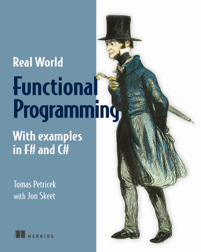</a>

### [Real-World Functional Programming](http://functional-programming.net/rwfp/)

{:class="book-author"}
Tomas Petricek with Jon Skeet, Manning, 2012

Written by Tomas Petricek with Jon Skeet, this best-selling tutorial teaches the ideas and
techniques of functional programming applied to real-world problems. You'll see how the
functional way of thinking changes the game for .NET developers. Then, you'll tackle common
issues using a functional approach. The book will also teach you the basics of the F#
language and extend your C# skills into the functional domain.

> *"You will never look at your code in the same way again."*
  from the foreword by Mads Torgersen, C# PM, Microsoft
  

 <!-- END # Col -->

 <!-- END # Row -->

  

<a href="http://www.gitbook.com/book/swlaschin/fsharpforfunandprofit/">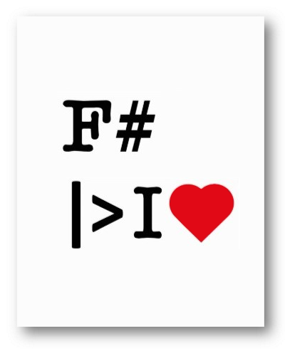</a>

### [F# for Fun and Profit (e-book)](http://www.gitbook.com/book/swlaschin/fsharpforfunandprofit/)

{:class="book-author"}
Scott Wlaschin

The e-book version of Scott's <a href="http://fsharpforfunandprofit.com">fsharpforfunandprofit.com</a> web site.
Perfect if you want to browse the site offline while commuting or on a flight.
The site (and this book) aims to introduce you to F# and show you ways that F# can help in day-to-day development of mainstream commercial business software. On the way, I hope to open your mind to the joys of functional programming - it really is fun!                              

> *"The best teacher there is of functional programming concepts"*
  Larry O'Brien, founding editor of Software Development magazine

 <!-- END # Col -->

 <!-- END # Row -->

  

<a href="https://vimeo.com/131640714">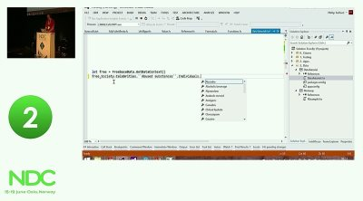</a>

#### [F# for C# Developers](https://vimeo.com/131640714)
  
{:class="author"}
Phil Trelford, NDC Oslo 2015

Everything you ever wanted to know about F# as a C# dev, but were afraid to ask.

 <!-- END # Col -->

<a href="https://vimeo.com/161995115">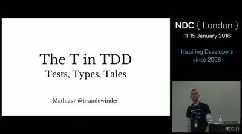</a>

#### [The T in TDD: Tests, Types, Tales](https://vimeo.com/161995115)
  
{:class="author"}
Mathias Brandewinder, NDC London 2016

How types in F# changed the way I think about TDD and software development.

 <!-- END # Col -->

<a href="https://vimeo.com/97507575">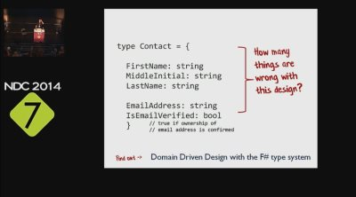</a>

#### [Domain modelling with the F# type system](https://vimeo.com/97507575)
  
{:class="author"}
Scott Wlaschin, NDC Oslo 2014

Using the F# types to make invalid states unrepresentable (and your code correct).

 <!-- END # Col -->

<a href="https://vimeo.com/97315970">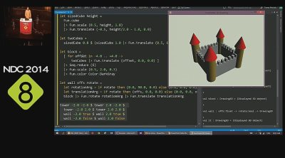</a>

#### [Domain Specific Languages, the functional way](https://vimeo.com/97315970)
  
{:class="author"}
Tomas Petricek, NDC Oslo 2014

Using simple functional concepts to build powerful DSLs for fun and profit.

 <!-- END # Col -->

<a href="https://vimeo.com/162056569">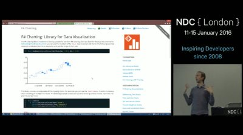</a>

#### [Building stuff that works with F#](https://vimeo.com/162056569)
  
{:class="author"}
Tomas Petricek, NDC London 2016

Using F# for the boring things: testing, build scripts and documentation

 <!-- END # Col -->

 <!-- END # Row -->

<a name="mlds">

## Machine learning and data science

Machine learning (ML) is becoming an extremely important topic and F# is the perfect
tool for doing ML (not just) on the .NET platform. Books and talks in
this category give you all the information you need to get started with using F# for
data science and machine learning.

F# is a great fit for implementing your efficient own algorithms, but it can also access
a wide range of powerful libraries including <a href="http://www.fslab.org">FsLab</a>
for data science, <a href="http://www.mbrace.io">MBrace</a> for extreme scalability
and <a href="http://bluemountaincapital.github.io/FSharpRProvider/">R through the R type provider</a>.

 <!-- END # Row -->

 

  <a href="http://www.amazon.com/dp/1430267674/">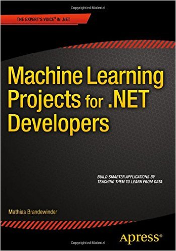</a>

### [Machine Learning Projects for .NET Developers](http://www.amazon.com/dp/1430267674/)

{:class="book-author"}
Mathias Brandewinder, Apress, 2015

The book shows you how to build smarter .NET applications that learn from data, using simple
algorithms and techniques that can be applied to a wide range of real-world problems. You'll
code each project in the familiar setting of Visual Studio, while the machine learning logic
uses F#, a language ideally suited to machine learning applications in .NET. If you're new to
F#, this book will give you everything you need to get started. If you're already familiar
with F#, this is your chance to put the language into action in an exciting new context.

> *"Awesome read! The book explains ML concepts in a very easy and compelling
  manner, with great and well explained codes samples."* Amazon review by
  <a href="http://www.amazon.com/gp/customer-reviews/R5N3XU9GE3SCQ/ref=cm_cr_arp_d_rvw_ttl?ie=UTF8&ASIN=1430267674">Terrell Bryonyq</a>
  

 <!-- END # Col -->

 <!-- END # Row -->

 

  

### [Analyzing and Visualizing Data with F#](http://fslab.org/report/)

{:class="book-author"}
Tomas Petricek, O'Reilly, 2015 (free report)

In this report, F# contributor Tomas Petricek explains many of the key features of the F#
language that make it a great tool for data science and machine learning. Real world examples
take you through the entire data science workflow with F#, from data access and analysis to presenting the results. 

You'll learn about how F# and its unique features ease the chore of data access,
the process of data analysis and visualization, using Deedle, R type provider and XPlot and
finally, implementations for a clustering algorithm using the standard F# library and how the F# type inference helps you understand your code.

 <!-- END # Col -->

 <!-- END # Row -->

 

<a href="https://vimeo.com/97514517">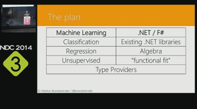</a>

  

    <h4><a href="https://vimeo.com/97514517">F# and Machine Learning: a winning combination</a></h4>
    
Mathias Brandewinder, NDC Oslo 2014

    
Why choose F# if you are doing machine learning on .NET.

  

  

<a href="https://vimeo.com/113597999">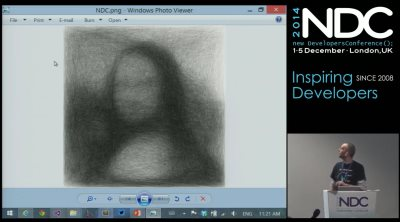</a>

  

    <h4><a href="https://vimeo.com/113597999">Mona Lisa, F# and Azure: simple solutions to hard problems</a></h4>
    
Mathias Brandewinder, NDC London 2014

    
Solving the traveling salesman problem using MBrace and Azure.

  

  

<a href="https://channel9.msdn.com/posts/Understanding-the-World-with-F">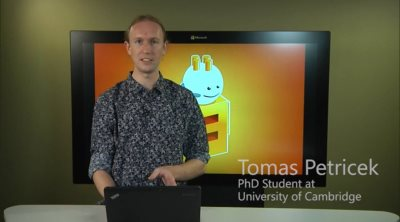</a>

  

    <h4><a href="https://channel9.msdn.com/posts/Understanding-the-World-with-F">Understanding the World with F#</a></h4>
    
Tomas Petricek, Channel 9, 2013

    
Using type providers for JSON, CSV and XML for data analytics.

  

  

<a href="https://vimeo.com/131637364">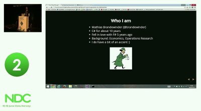</a>

  

    <h4><a href="https://vimeo.com/131637364">Crunching through big data with MBrace, Azure and F#</a></h4>
    
Mathias Brandewinder, NDC Oslo 2015

    
From explorative REPL to the cloud, using MBrace and the power of F#.

  

  

  

    <h4><a href="https://vimeo.com/171317247">Analysing Big Time-series Data in the Cloud</a></h4>
    
Tomas Petricek, NDC Oslo 2016

    
Using BigDeedle, FsLab and MBrace to understand UK housing crisis.

  

  

<a href="https://vimeo.com/171704652">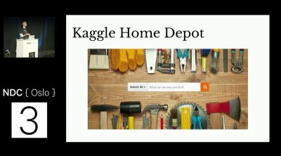</a>

  

    <h4><a href="https://vimeo.com/171704652">Agile experiments in Machine Learning with F#</a></h4>
    
Mathias Brandewinder, NDC Oslo 2016

    
Kaggle case study on how "doing machine learning" workflow looks like.

  

 <!-- END # Col -->

 <!-- END # Row -->

<a name="web">

## Web development and cloud services

One of the myths about F# is that it is only good for complex mathematics. This could
not be further from truth. A web server is essentially a function from a request to a
response and so functional programming is a perfect fit for it.

Talks in this category cover some of the most popular F# tools for doing web development
including the functional cross-platform web server <a href="http://www.suave.io">Suave</a>,
but you can also learn about building and hosting cloud-based services on Azure.

 <!-- END # Col -->

 <!-- END # Row -->

  

<a href="https://vimeo.com/131641270">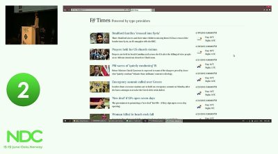</a>

  

    <h4><a href="https://vimeo.com/131641270">End-to-end Functional Web Development</a></h4>
    
Tomas Petricek, NDC Oslo 2015

    
Building news site and chat using Suave, F#, type providers and agents.

  

  

  

    <h4><a href="https://vimeo.com/113725369">The Great @fsibot Caper</a></h4>
    
Mathias Brandewinder, NDC London 2014

    
Building a cloud-based service that reacts to tweets using F# compiler service.

  

  

<a href="https://skillsmatter.com/skillscasts/7375-celebrating-new-year-s-eve-with-f-sharp-and-suave">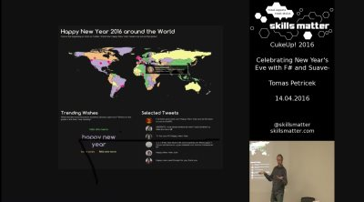</a>

  

    <h4><a href="https://vimeo.com/131641270">Celebrating New Year's Eve with F# and Suave</a></h4>
    
Tomas Petricek, F# eXchange 2016

    
Reactive web programming with New Year tweets as the data source.

  

<a name="enterprise">

## Using F# in the enterprise & architecture

F# is a great language for developing enterprise applications in various domains including
retail, advertising, finance and many more. The functional-first nature of the F# language leads you towards the "happy path" of
correctness and extensibility.

The materials in this section provide all you need to build the right functional architecture. You can watch
Scott Wlaschin's amazing series of talks on functional patterns or explore a number of case studies
of using F# in the industry.

 <!-- END # Col -->

 <!-- END # Row -->

    

      <a href="http://functional-programming.net/deepdives/">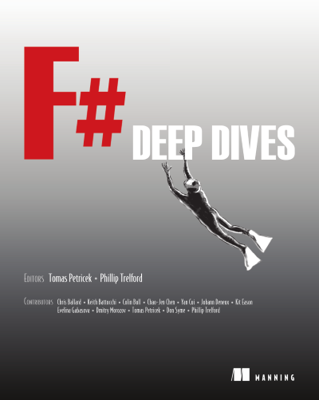</a>
    

    

      <h3><a href="http://functional-programming.net/deepdives/">F# Deep Dives</a></h3>
      
Edited by Tomas Petricek and Phil Trelford, Manning, 2014

      
F# Deep Dives presents a collection of real-world F# techniques, each written by
        expert practitioners. Each chapter presents a new use case where you'll read how the author
        used F# to solve a complex problem more effectively than would have been possible using
        a traditional approach. You'll not only see how a specific solution works in a specific
        domain, you'll also learn how F# developers approach problems, what concepts they use to
        solve them, and how they integrate F# into existing systems and environments.

      
<em>"Outstanding real-world examples that are sure to appeal to both the novice and expert."</em> 
        Jeff Smith ITT Education Services

    

  

  

    <h4><a href="https://vimeo.com/113707214">Railway oriented programming</a></h4>
    
Scott Wlaschin, NDC London 2014

    
Functional approach to error handling, input validation, logging and other annoyances.

  

  

<a href="https://www.youtube.com/watch?v=OonLCmLeQUQ">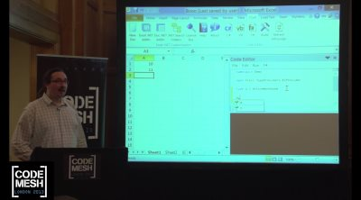</a>

  

    <h4><a href="https://www.youtube.com/watch?v=OonLCmLeQUQ">F# for Trading</a></h4>
    
Phil Trelford, CodeMesh London 2014

    
What makes F# great for implementing high-performance trading systems.

  

  

  

    <h4><a href="https://vimeo.com/162209391">Designing with capabilities</a></h4>
    
Scott Wlaschin, NDC London 2016

    
Using capabilities to design modular code that is easy to test and refactor.

  

  

<a href="https://vimeo.com/131196782">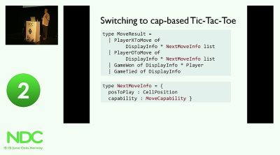</a>

  

    <h4><a href="https://vimeo.com/131196782">Enterprise Tic-Tac-Toe</a></h4>
    
Scott Wlaschin, NDC London 2015

    
Practical enterprise-ready functional development, demonstrated using Tic-Tac-Toe!

  

  

<a href="https://vimeo.com/113588389">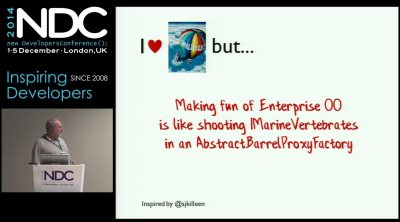</a>

  

    <h4><a href="https://vimeo.com/113588389">Functional programming design patterns</a></h4>
    
Scott Wlaschin, NDC London 2014

    
Which OOP patterns are still useful? And what are new patterns that apply to FP?

  

  

    <h2>Functional, compilers, performance &amp; fun!</h2>
    
Do you want to learn more about functional programming and F#? Then the talks in this section are the
      place to explore! Learn about more advanced functional programming concepts (did we say <em>monads</em>?),
      techniques for choosing the right data structure, compilers, but also some of the powerful F# libraries
      like <a href="http://tpetricek.github.io/FSharp.Formatting">F# Formatting</a> and the awesome tool for
      building presentations called <a href="http://fsprojects.github.io/FsReveal/">FsReveal</a>.
    

  

  

  

    <h4><a href="https://vimeo.com/162054542">Dr Frankenfunctor and the Monadster</a></h4>
    
Scott Wlaschin, NDC London 2016

    
Warning! This talk contains gruesome topics, strained analogies, discussion of monads.

  

  

<a href="https://vimeo.com/124021617">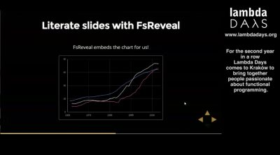</a>

  

    <h4><a href="https://vimeo.com/124021617">Literate_programming.With("F#")</a></h4>
    
Tomas Petricek, Lambda Days 2015

    
In this talk, Tomas describes how he built his slides using F#. As one does.

  

  

<a href="https://vimeo.com/113588390">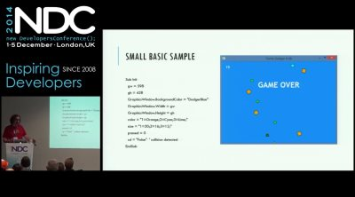</a>

  

    <h4><a href="https://vimeo.com/113588390">Write Your Own Compiler in 24 Hours</a></h4>
    
Phil Trelford, NDC London 2015

    
Compiler writers are often seen as the stuff of myth and legend. Unveil the reality!

  

  

<a href="https://www.youtube.com/watch?v=hx2vOwbB-X0&feature=youtu.be&list=PLWbHc_FXPo2jB6IZ887vLXsPoympL3KEy">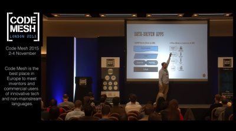</a>

  

    <h4><a href="https://www.youtube.com/watch?v=hx2vOwbB-X0&feature=youtu.be&list=PLWbHc_FXPo2jB6IZ887vLXsPoympL3KEy">Beyond Lists: High Performance Data Structures</a></h4>
    
Phil Trelford, CodeMesh London 2015

    
Selecting appropriate data structures is key to your application's performance.

  

  

<a href="https://vimeo.com/171704565">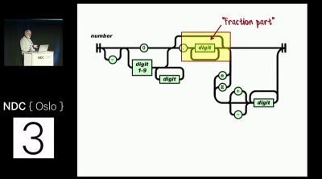</a>

  

    <h4><a href="https://vimeo.com/171704565">Understanding parser combinators: a deep dive</a></h4>
    
Scott Wlaschin, NDC Oslo 2016

    
Implementing parser combinators from scratch and parsing JSON in 45 minutes.

  

  

    <h1>Conferences and publishers</h1>
    

      Over the years, we had the pleasure of speaking at a number of conferences and working
      with several publishers. If you are interested in meeting in person, you'll often find
      us at events organized by our partners listed here. Are you interested in having
      fsharpWorks experts at your event?
      <a href="mailto:info@fsharpworks.com">Drop us an email to discuss what we can do for you!</a>
    

    

      
      <a href="http://www.lambdadays.org/">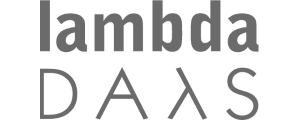</a>
      <a href="http://www.ndc-oslo.com/">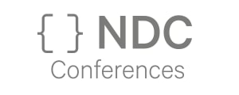</a>
      
      <a href="http://www.apress.com/">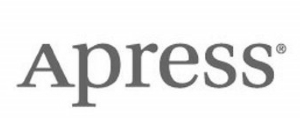</a>
      
      
    

  

